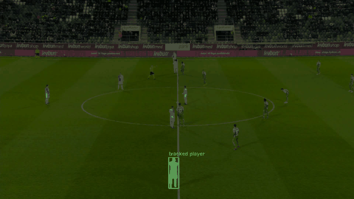

# follow-anything 🎯

**Promptable, track-anything video — point at any object (a player, a car, a person, an animal) and follow it through the clip; detect and track *everything* on screen; and, as the flagship, lift the scene into a 3D bird's-eye replay.**

Football is the proving ground — dense, fast, near-identical targets and broadcast camera cuts make it tracking on *hard mode* — but the pipeline is **domain-agnostic**: the detector already knows people, cars and bikes, and SAM 2 will follow literally anything you click.

> **Status: active build.** Two rungs shipped — a rigorous baseline and a promptable "follow one object" demo. Roadmap below.



*Click one object on the first frame → SAM 2 spotlights and follows it through the clip (here, a football player). The same code follows a car, a person, an animal — anything you point at.*

---

## Vision
Given ordinary video, `follow-anything` aims to:
1. Track every object with **persistent identities**.
2. Be **promptable** — click/box any object (even a category it never trained on) and follow just that one (SAM 2).
3. Maintain **object permanence** — identities survive occlusion *and* camera cuts.
4. Run in **real time, on-device** — distil the promptable model down to laptop/phone speed.
5. Reconstruct the scene in **3D** — showcase: a top-down / 3D football tactical replay.

## Roadmap
| Rung | Milestone | Status |
|---|---|---|
| 1 | Baseline tracking (YOLO + BoT-SORT) → **bbox-HOTA 0.481** on a held-out game | ✅ |
| 2 | Promptable "click any object, follow it" (SAM 2) | ✅ demo |
| 3 | Robust — occlusion + re-ID + ball; beat the baseline | ⬜ |
| 4 | Permanence — re-acquire IDs across camera cuts | ⬜ |
| 5 | Real-time / on-device — distil to live FPS | ⬜ |
| 6 | 3D tactical replay — homography top-down → depth-lifted 3D | ⬜ |

> Full scope, invariants, and per-rung definition-of-done: **[docs/PROJECT_PLAN.md](docs/PROJECT_PLAN.md)**.

## Results
**Rung 1 — zero-shot baseline** (YOLO11n + BoT-SORT, no training), bbox-HOTA via TrackEval, all object categories (SoccerNet **SN-GSR-2025**, leave-one-game-out):

| set | HOTA | DetA | AssA | MOTA | IDF1 | IDSW |
|---|---|---|---|---|---|---|
| dev benchmark (`train` game 4, 18 clips) | 0.481 | 0.611 | 0.381 | 0.734 | 0.541 | 2339 |
| **untouched final** (`valid` game 2, 18 clips) | **0.492** | 0.602 | 0.403 | 0.714 | 0.551 | 1869 |

The untouched-final number (0.492) matches the dev number (0.481) — confirming the baseline isn't inflated by evaluation-selection on the dev game. Association (AssA ≈ 0.40) is the weaker half — the target for the next rungs. Every number carries a provenance manifest (git SHA, package versions, weight hash, category counts). SoccerNet's official metric is GS-HOTA over pitch coordinates (the rung-6 flagship).

**Rung 2 — promptable demo** (`scripts/07_promptable_demo.py`): give one object a click/box on the first frame and SAM 2 propagates the mask through the clip, rendering a *spotlight-that-object* video. Runs on Apple MPS; tracked the prompted player in 72/90 frames of a test clip.

## What makes it rigorous (not a tutorial)
- **Leak-free evaluation** — game/match-disjoint splits, so no clip from a test match is ever seen in training (`src/pitchvision/data/splits.py`). Naive frame-level splits leak near-duplicate frames and inflate scores; we refuse to.
- **Validated metric** — HOTA / MOTA / IDF1 via TrackEval, unit-tested to exact values on synthetic sequences (`scripts/02_eval_selftest.py`) before trusting it on real data.
- **Honest baselines** — sanity-checked hard enough to catch a real tracker-reset bug that would otherwise have reported a fake HOTA of 0.13.

## Works on any video
Both engines are general-purpose. **YOLO** detects 80 everyday classes (people, cars, buses, bikes, …) out of the box; **SAM 2** is class-agnostic and follows *anything* you point at. Swapping football for traffic monitoring, wildlife, or retail analytics is mostly a matter of the input video and the target class list. *(The Rung-1 tracker currently runs on COCO persons + sports-ball; enabling more classes is a one-line change — the "track everything" framing is the roadmap target, not yet the shipped scope.)* *(Tracking specific people is surveillance — mind privacy, consent and law; keep showcases benign or clearly authorized.)*

## Repo layout
```
follow-anything/
├── configs/default.yaml            # paths, detector/tracker, split & eval policy
├── src/pitchvision/                # core package (name predates the rename)
│   ├── config.py                   # config loader + device (cuda/mps/cpu)
│   ├── data/splits.py              # match-disjoint splitting (rigor centrepiece)
│   ├── data/gsr.py                 # SoccerNet GSR labels -> MOT rows
│   ├── eval/mot_eval.py            # HOTA/MOTA/IDF1 via TrackEval
│   ├── pipeline/run_video.py       # detect -> track -> annotated video + MOT file
│   └── promptable/sam2_track.py    # SAM 2 "click, follow" propagation
├── scripts/                        # numbered, runnable pipeline steps (00, 02-07)
└── data/  outputs/  notebooks/  tests/
```

## Setup
Requires **Python 3.10+** (3.12 recommended; SAM 2 needs ≥ 3.10).
```bash
python3.12 -m venv .venv && source .venv/bin/activate
# Install PyTorch for your platform first — https://pytorch.org/get-started/locally/
pip install -r requirements.txt
# SAM 2 builds from source; on non-CUDA machines: SAM2_BUILD_CUDA=0 pip install -r requirements.txt
```

## Quickstart
Zero-training tracked clip (COCO-pretrained YOLO already knows people, ball, cars, …):
```bash
python scripts/00_smoke_test.py --video data/sample.mp4
```
Promptable "follow one object" (spotlight video):
```bash
python scripts/07_promptable_demo.py --clip <clip> --frames 90
```

## Data
Football experiments use **SoccerNet SN-GSR-2025** (Game State Reconstruction), a gated Hugging Face dataset. After `hf auth login` (with dataset access):
```bash
python scripts/01_download_gsr.py --split train       # dev source (has labels)
python scripts/05_gsr_make_splits.py                  # leave-one-game-out split (fail-closed)
python scripts/06_gsr_baseline_eval.py --split test   # baseline HOTA + provenance manifest
```
`train` is the development source; the official `valid` split is the untouched final-confirmation set (`--split valid`). The pipeline itself is data-agnostic.

## Credits & licenses
Ultralytics YOLO (**AGPL-3.0** — review before redistribution), SAM 2 (Apache-2.0), TrackEval (MIT), SoccerNet (research license). Check each before publishing derivatives.
